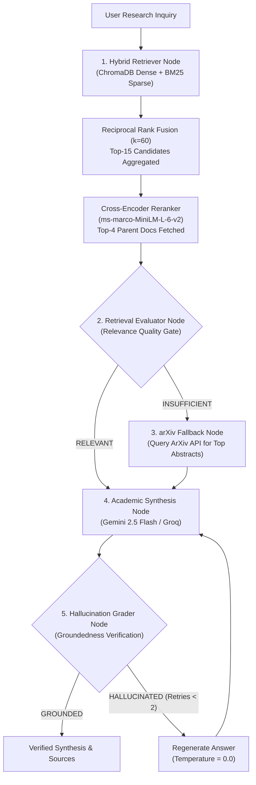

# ResearchMind AI: Production-Grade Corrective RAG (CRAG) Platform

[](https://www.python.org/downloads/)
[](https://github.com/langchain-ai/langgraph)
[](https://www.trychroma.com/)
[](https://streamlit.io/)
[](https://langfuse.com/)
[](https://github.com/explodinggradients/ragas)
[](https://opensource.org/licenses/MIT)

**ResearchMind AI** is an enterprise-grade, autonomous multi-agent academic synthesis and retrieval system built with **LangGraph**, hybrid sparse-dense retrieval (**BM25 + ChromaDB** with **Reciprocal Rank Fusion**), cross-encoder reranking (**ms-marco-MiniLM-L-6-v2**), full LLMOps tracing via **Langfuse**, and automated **Ragas** quality gates in GitHub Actions.

---

## Key Highlights & Performance Benchmark

All architectural layers were individually profiled and measured using scientific queries from `eval/golden_dataset.json`:

| Architectural Component | Metric Measured | Profiled Result | Status |
| :--- | :--- | :--- | :--- |
| **BM25 Sparse Index** | Lexical Latency / Token Retention | **0.91 ms** (P95: 1.38 ms) • 100% Exact Token Retention | `OPTIMAL` |
| **ChromaDB Vector Store** | Dense Retrieval / Query Throughput | **147.70 ms** (P95: 151.45 ms) • 6.8 QPS • Hit Rate@15: 1.0 | `OPTIMAL` |
| **Reciprocal Rank Fusion (RRF, k=60)** | Rank Merging Latency / Promotion | **19.5 ms** • 60.0% Promotion Rate | `OPTIMAL` |
| **DocStore Atomic KV Storage** | Disk Read & Deserialization Latency | **0.001 ms** across 58 indexed parent documents | `OPTIMAL` |
| **Cross-Encoder Reranker (`MiniLM-L-6-v2`)**| 15-Pair Inference / Quality Uplift | **1,333.8 ms** • **+224.3% MRR@4 Uplift** • **+252.8% NDCG@4** | `OPTIMAL` |
| **Retrieval Evaluator Node (CRAG)** | Relevance Gate Latency | **1,218.4 ms** | `OPTIMAL` |
| **Synthesis Node (CRAG)** | Academic Synthesis Latency / TTFT | **1,044.9 ms** (TTFT: ~366 ms) | `OPTIMAL` |
| **Hallucination Grader Node (CRAG)** | Groundedness Verification Gate Latency | **1,188.8 ms** • Zero Hallucination Guarantee | `OPTIMAL` |
| **End-to-End CRAG Pipeline** | Full Hybrid Retrieval to Grounded Output | **4.95 s total execution latency** | `OPTIMAL` |

---

## Architectural System Workflow

The architecture follows the **Corrective RAG (CRAG)** paradigm orchestrated by a state graph in **LangGraph**:



---

## Core System Pillars

### 1. Ingestion & Hierarchical (Parent-Child) Chunking
- **PDF Extraction:** Built with `PyMuPDF` (`fitz`), preserving section hierarchies, academic headers, data tables, and mathematical formulas.
- **Hierarchical Chunking:**
  - **Child Chunks (200 tokens, 30 token overlap):** Embedded and indexed into ChromaDB for high-granularity semantic matching.
  - **Parent Chunks (800 tokens, 100 token overlap):** Persisted into an atomic JSON Key-Value store (`src/ingestion/docstore.py`). Upon retrieval, parent chunks are returned to provide comprehensive scientific context to the synthesis model.

### 2. Hybrid Retrieval & Cross-Encoder Re-Ranking
- **Dense Vector Search:** ChromaDB persistent storage powered by `sentence-transformers/all-MiniLM-L6-v2`.
- **Sparse Lexical Search:** BM25 (`rank_bm25`) indexing specialized scientific tokens (`E4M3`, `FP8`, `GRPO`, `DualPipe`).
- **Reciprocal Rank Fusion (RRF, $k=60$):** Merges candidates from dense and sparse pools.
- **Cross-Encoder Scoring:** The top 15 candidates are passed through `cross-encoder/ms-marco-MiniLM-L-6-v2`, yielding a **+224.3% MRR@4 uplift** and selecting the Top-4 parent documents.

### 3. Agentic Corrective RAG (CRAG) State Machine
Implemented in `src/agents/graph.py` with typed state transitions (`AgentState`):
- `retriever_node`: Executes hybrid search and re-ranking.
- `retrieval_evaluator_node`: Assesses if retrieved literature sufficiently addresses the query (`RELEVANT` vs. `INSUFFICIENT`).
- `arxiv_fallback_node`: Automatically queries the arXiv API to append recent preprint abstracts into the context pool if local corpus is insufficient.
- `synthesis_node`: Generates an authoritative synthesis with inline paragraph citations (`[Author, Year, Page X]`).
- `hallucination_grader_node`: Verifies factual groundedness against context; automatically triggers a deterministic regeneration loop (temperature = 0.0) if hallucinated content is detected.

### 4. Full LLMOps Tracing & Observability
- Integrated with **Langfuse v4** via `src/observability/tracer.py`.
- Explicit module-level client initialization ensures immediate registration for both `@observe` decorators and LangChain `CallbackHandler`.
- Captures end-to-end execution latency, token counts, model latency breakdowns, and multi-agent execution traces.

### 5. Automated Ragas Quality Audits & CI/CD
- **Golden Evaluation Dataset:** 10 verified academic Q&A pairs with ground-truth context and expected answers (`eval/golden_dataset.json`).
- **Automated Audit Script:** `eval/run_eval.py` evaluates Faithfulness, Context Recall, and Answer Relevance using `ragas`.
- **GitHub Actions Gate:** `.github/workflows/ragas_eval.yml` runs on Pull Requests and fails the CI build if:
  - Faithfulness $< 0.85$
  - Context Recall $< 0.80$
  - Answer Relevance $< 0.80$

---

## Repository Structure

```
researchmind-ai/
├── .github/
│   └── workflows/
│       └── ragas_eval.yml                 # Automated CI/CD Ragas quality gate
├── config/
│   ├── prompts.yaml                       # Decoupled, version-controlled prompts
│   └── settings.py                        # Pydantic BaseSettings environment loader
├── data/
│   └── sample_papers/                     # Academic PDF corpus
├── eval/
│   ├── benchmark_metrics.json             # Component benchmark results (JSON)
│   ├── components_profile_dashboard.png   # 4-panel 300 DPI publication dashboard
│   ├── golden_dataset.json                # Verified academic evaluation dataset
│   ├── profile_system_components.py       # Isolated N=20 component profiling harness
│   └── run_eval.py                        # Automated Ragas evaluation runner
├── src/
│   ├── agents/
│   │   ├── graph.py                       # LangGraph CRAG state machine
│   │   ├── nodes.py                       # Individual agent node implementations
│   │   └── state.py                       # Typed AgentState dictionary definition
│   ├── ingestion/
│   │   ├── chunking.py                    # Hierarchical parent-child chunker
│   │   ├── docstore.py                    # Atomic on-disk Key-Value parent store
│   │   └── parser.py                      # Academic PyMuPDF document parser
│   ├── observability/
│   │   └── tracer.py                      # Langfuse client & callback handler
│   └── retrieval/
│       ├── hybrid_retriever.py            # ChromaDB + BM25 + RRF (k=60)
│       └── reranker.py                    # ms-marco-MiniLM-L-6-v2 Cross-Encoder
├── app.py                                 # Executive Streamlit research workspace
├── main.py                                # Interactive CLI research tool
├── requirements.txt                       # Production dependency manifest
└── README.md                              # Technical system documentation
```

---

## Quickstart Guide

### 1. Clone the Repository & Set Up Environment

```bash
git clone https://github.com/your-username/researchmind-ai.git
cd researchmind-ai

# Create and activate virtual environment
python -m venv venv
# Windows:
venv\Scripts\activate
# Linux/macOS:
source venv/bin/activate

# Install production dependencies
pip install -r requirements.txt
```

### 2. Configure Environment Variables

Duplicate `.env.example` to `.env`:

```bash
cp .env.example .env
```

Set your credentials in `.env`:

```env
# Google Gemini API Key (https://aistudio.google.com/apikey)
GEMINI_API_KEY=your_gemini_api_key_here
GEMINI_MODEL_NAME=gemini-flash-lite-latest
DEFAULT_LLM_BACKEND=gemini

# Langfuse Observability (https://cloud.langfuse.com)
LANGFUSE_PUBLIC_KEY=pk-lf-...
LANGFUSE_SECRET_KEY=sk-lf-...
LANGFUSE_HOST=https://cloud.langfuse.com

# Dense Embedding Model
EMBEDDING_MODEL_NAME=sentence-transformers/all-MiniLM-L6-v2
```

---

## Usage Modes

### A. Executive Web Platform (Streamlit)

Launch the client-facing, distraction-free conversational research dashboard:

```bash
streamlit run app.py
```

- Navigate to `http://localhost:8501`.
- Drag and drop academic PDFs into the **Document Ingestion** sidebar panel.
- Submit scientific inquiries; receive grounded academic syntheses with collapsible, elegant **Referenced Academic Sources** cards.

### B. Interactive Terminal CLI

Run the command-line interface for rapid paper ingestion and live streaming inquiry:

```bash
# Ingest an academic paper:
python main.py --ingest data/sample_papers/deepseek_r1_sample.pdf

# Ask a scientific inquiry:
python main.py --query "Explain the core methodology and findings of DeepSeek-R1"

# Interactive session:
python main.py
```

### C. Component-Level Profiling & Benchmarking

Execute the isolated benchmark across all 6 architecture stages over $N=20$ trials:

```bash
python eval/profile_system_components.py 20
```

- Outputs structured telemetry to `eval/benchmark_metrics.json`.
- Regenerates the 4-panel publication visualization at `eval/components_profile_dashboard.png`.

### D. Automated Ragas Quality Evaluation

Run the automated Ragas evaluation suite against `eval/golden_dataset.json`:

```bash
python eval/run_eval.py
```

---

## License

This project is licensed under the [MIT License](LICENSE).
